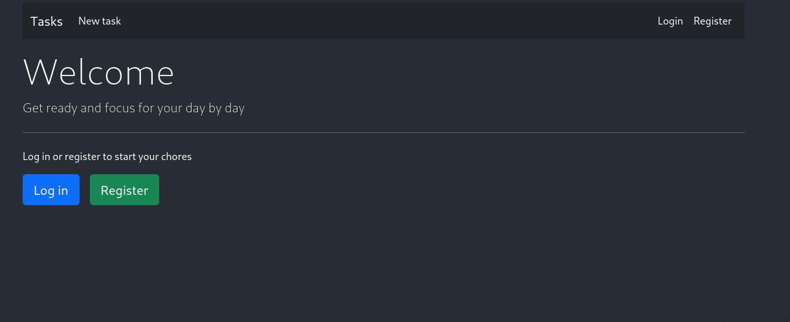
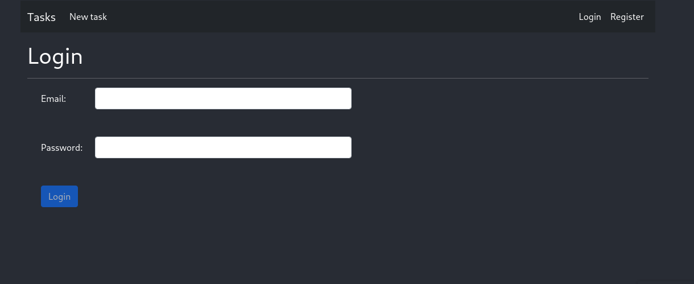
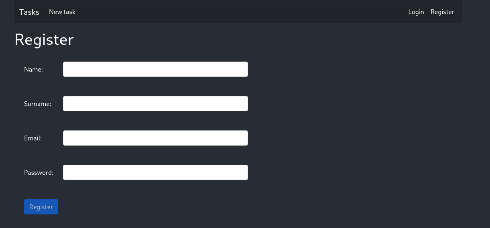
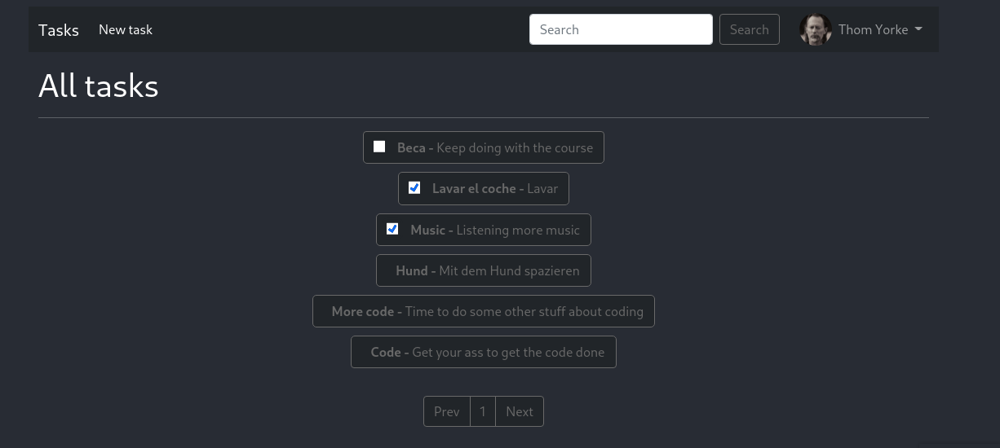
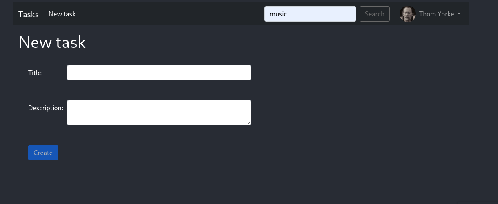
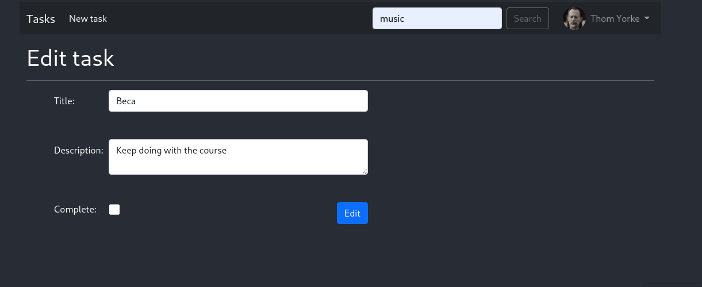
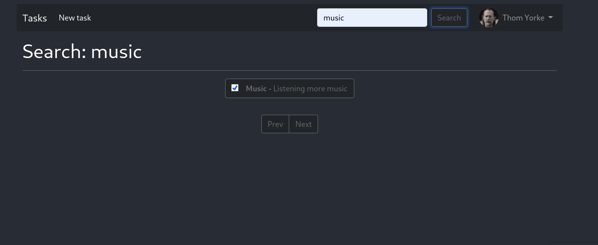
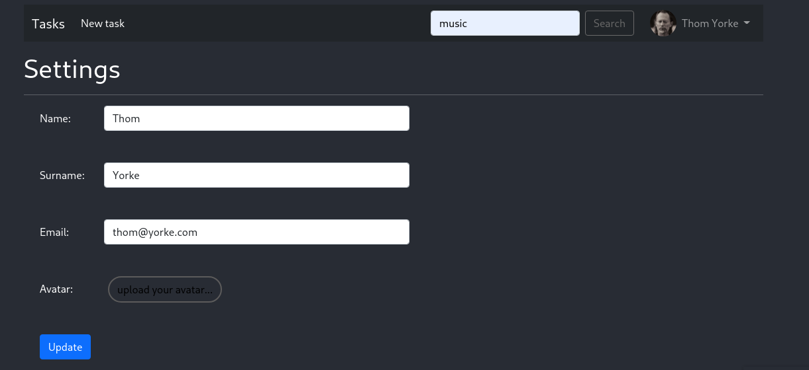

# This is a simple To-Do list written in Javascript and PHP

## Technologies used in this project
### Symfony 6.0.3 for the backend
### Angular 13.1.4 for the frontend
### Bootstrap 5 plus other selfmade styles

## Overview
### Home page

### Log in page

### Register page

### Tasks page

### New task page

### Edit task page

### Search page

### User settings page

